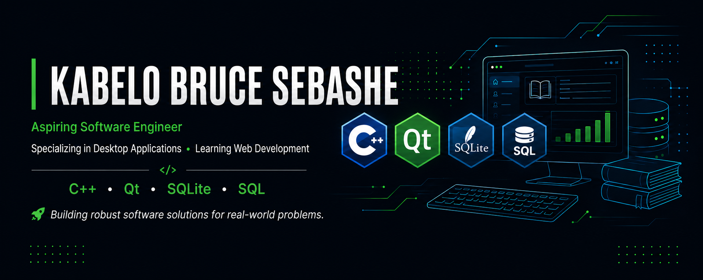

  

<h1 align="center">Hi there, I'm Kurende</h1>

<h3 align="center">
Aspiring Software Engineer
</h3>

Specializing in Desktop Applications • Learning Web Development

Building robust software solutions for real-world problems.

---

## 👨‍💻 About Me

I'm a **BSc Informatics student** from South Africa with a passion for building reliable software using modern C++ and Qt.

I enjoy designing software that solves practical problems through clean user interfaces, structured code, and efficient database systems.

My current flagship project is **LibraCore**, a desktop Library Management System built using **C++**, **Qt**, **SQLite**, and **SQL**.

Although desktop application development is my primary focus, I'm actively learning **modern web development** to broaden my software engineering skills and eventually build full-stack applications.

I'm always looking for opportunities to learn, collaborate, and create software that makes a meaningful real-world impact.

---

## 🚀 Current Project

<h1>
  
  LibraCore
</h1>

A desktop Library Management System designed for South African schools.

  

### Features

- 🔐 User Authentication
- 👨‍🎓 Learner Management
- 📚 Book Management
- 📖 Borrow & Return Management
- ❌ Lost Book Tracking
- 💳 Payment Processing
- 📊 Dashboard & Reports
- 📝 Activity Logging

---

## 🛠 Tech Stack

### Languages

---

### Frameworks

---

### Database

---

### Tools

---

## 🌱 Currently Learning

- 🌐 HTML5
- 🎨 CSS3
- ⚡ JavaScript

---

## 🎯 Career Goals

- Build production-quality software
- Master Modern C++
- Become an expert in Qt Framework
- Learn Full-Stack Web Development
- Contribute to Open Source
- Build software that improves people's lives

---

## 📊 GitHub Statistics

---

## 🔥 GitHub Streak

---

## 🏆 GitHub Trophies

---

## 📌 Featured Repositories

⭐ LibraCore

Desktop Library Management System built using C++, Qt, SQLite and SQL.

More exciting projects are coming soon!

---

## 📫 Let's Connect

---

## 👀 Profile Views

---

> *"Building robust software solutions for real-world problems."*

